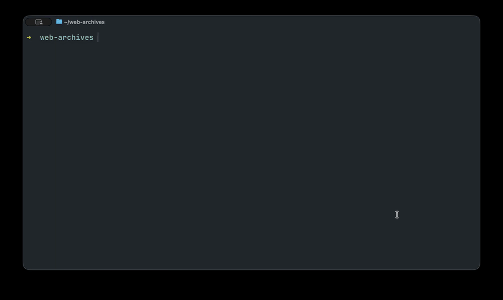

# btrix

Make high-fidelity web archives with [Browsertrix
Crawler](https://github.com/webrecorder/browsertrix-crawler), by chatting with
your favorite LLM, and describing what you want archived. Crawls run locally in
a container and produce WACZ files you can replay in
[ReplayWeb.page](https://replayweb.page).



There is also a [project page](https://edsu.github.io/btrix/).

## Install

macOS or Linux, [Docker or Podman](https://docs.docker.com/get-docker/), and
Node 22.19+. On Windows, run btrix inside WSL2 — that is where Docker Desktop
keeps its engine anyway, and the Linux paths it gives you are what the crawler
container expects.

```bash
npm install -g @edsu/btrix
btrix
```

On first run btrix asks you to connect a language model: type `/login` for a
Claude, ChatGPT or Copilot subscription, or set an API key such as
`ANTHROPIC_API_KEY`. Crawling itself needs no account, and a model on your own
machine or behind your own gateway works too — see [Using your own model
endpoint](#using-your-own-model-endpoint).

Your model credential and btrix's own preferences live in `~/.btrix`, kept
apart from anything else on the machine. Point `BTRIX_AGENT_DIR` somewhere else
to move them — including at `~/.pi/agent`, if you already use
[pi](https://pi.dev) and would rather share one login.

btrix is built on the pi agent harness, which comes along as a dependency; you
do not need to install or know anything about it. If you already use pi, you
can load btrix as an extension instead with
`pi install git:github.com/edsu/btrix`.

## Use

`cd` to a working directory and run `btrix`. It opens with what is in the store
and what to do next:

```
 _     _         _
| |__ | |_  _ _ (_)__ __    high-fidelity web archives
| '_ \|  _|| '_|| |\ \ /    Browsertrix Crawler, driven by conversation
|_.__/ \__||_|  |_|/_\_\

  ./btrix · 39G free · anthropic/claude-opus-5
  3 configs · 1 archive 40M · 1 login profile

  cultprotest              crawling      12/30
  sulnews → stanford-news  done          25/25  40M
  toi                      never run

  cultprotest is still crawling — watch the progress below.
  ♥ Webrecorder builds the crawler — https://opencollective.com/webrecorder
```

Then say what you want.

| You say | What happens |
|---|---|
| "archive the news section of library.stanford.edu" | Writes a config, having settled the scope with you first |
| "crawl sulnews" | Starts the crawl in the background; progress appears in the widget |
| "how's it going?" | Reads the crawl's state — though the widget is usually already showing it |
| "stop it" | Asks the crawler to shut down cleanly, keeping what it captured |
| "what do I have?" | Configs, crawls, archives, failed runs, free space |
| "did that crawl work?" | What was actually captured, with anything suspicious flagged |
| "replay stanford-news" | Serves the archive and gives you a ReplayWeb.page link |
| "this site needs a login" | Opens a browser for **you** to log into; btrix never sees the password |
| "why did this site only give me one page?" | Opens a real browser to work out a custom behavior |
| "what's taking up space?" | Reports old working directories, and clears them if you agree |

Keys and commands:

| | |
|---|---|
| `@` | Completes config, collection, archive and profile names |
| `/btrix [name]` | Repaint the progress widget, or show the inventory |
| `/replay [name]` | Open an archive in your browser |
| `/screencast` | Watch the live crawl |
| `/model`, `/login` | Switch model, add a provider |

While a crawl runs, a widget updates once a second, and progress also appears in
the terminal title:

```
btrix │ crawling sulnews · 142/201 · 71% · 3.2 pg/min · 1.2M/min
      archive 880M · profile 300M · 12G free · rate-limited 3 · screencast :9037
      fetching https://library.stanford.edu/news/some-page
```

Crawls are detached, so they outlive the session — quit, come back tomorrow, and
the widget picks the crawl back up. When one finishes you get a notification and
a summary.

## Where things go

Everything lives in one directory beside your work:

```
./
├── btrix/
│   ├── config/sulnews.yaml         your crawl configs
│   ├── out/sulnews.wacz            finished archives
│   ├── out/sulnews.btrix.json      how each was made
│   ├── profiles/                   browser logins
│   ├── runs/                       working files, kept for inspection
│   └── failed/                     runs that produced nothing
└── notes.md, .git/                 your stuff, untouched
```

`btrix --dir /Volumes/archive/sulnews` puts the whole store somewhere else —
useful for a large crawl on an external disk. `$BTRIX_DIR` does the same.

The store writes its own `.gitignore`, so archives and profiles stay out of
version control while `config/` remains yours to commit.

## Credentials

btrix never handles a password. For a site behind a login it opens a browser
at `127.0.0.1:9223`; you sign in there, click "Create Profile", and the profile is
saved into the store. Profiles hold session cookies, so they are kept private,
ignored by git, and mounted read-only into a crawl. Sessions expire — if a
logged-in crawl comes back full of login pages, make the profile again.

The browser noVNC runs on is published on loopback only, so the session you
type a password into is reachable from your machine and nowhere else.

Your model credential is a different thing, and lives in `~/.btrix`, which
btrix creates `0700`. `/login` writes it to `~/.btrix/auth.json` at mode `0600`.
If you add a provider by hand (see below), prefer `/login` over an `apiKey`
field, because `models.json` is written in the clear — `chmod 600` it if a real
key ends up there anyway.

## Using your own model endpoint

btrix talks to whatever model the harness can reach, so anything that speaks the
OpenAI API works: a server on your own machine — LM Studio, Ollama, vLLM,
llama.cpp — or a hosted gateway such as LiteLLM, OpenRouter, Together or Groq.
Both are the same mechanism. Declare the provider in `~/.btrix/models.json`.
That is btrix's own agent directory, so this does not touch the configuration of
anyone who also uses pi directly.

First check the URL, because it is the easiest thing to get wrong and the
failure is unhelpful:

```bash
curl -s -o /dev/null -w '%{http_code}\n' https://your-gateway.example.org/v1/models
```

A `401` means you are in the right place and need a key; on a keyless local
server you get `200` and a list. HTML, a redirect to a sign-in page, or a
certificate error means the API is not there — a portal or dashboard is a
different hostname from the endpoint it issues keys for. A certificate error
aborts before curl can tell you anything else, so open the host in a browser if
you hit one.

For a hosted gateway, declare it with no `apiKey` field:

```json
{
  "providers": {
    "litellm": {
      "name": "LiteLLM",
      "baseUrl": "https://your-gateway.example.org/v1",
      "api": "openai-completions",
      "models": [
        { "id": "claude-sonnet-4-5", "input": ["text", "image"], "contextWindow": 200000 }
      ]
    }
  }
}
```

Start btrix, type `/login litellm`, and paste the key. Leaving `apiKey` out is
what makes that work, and it puts the key in `~/.btrix/auth.json` at mode `0600`
instead of in `models.json` in the clear — worth the extra step for a key that
bills you. Then pick the model in `/model` and press Ctrl+S to make it the
default, or start with `btrix --provider litellm --model claude-sonnet-4-5`.

A local server is the same file with the key inlined, since there is no real key
to protect:

```json
{
  "providers": {
    "lmstudio": {
      "baseUrl": "http://localhost:1234/v1",
      "api": "openai-completions",
      "apiKey": "lmstudio",
      "compat": {
        "supportsDeveloperRole": false,
        "supportsReasoningEffort": false
      },
      "models": [
        { "id": "qwen/qwen3.8-27b", "contextWindow": 32768 }
      ]
    }
  }
}
```

That is the whole setup: no `/login`, and no credential file. The `apiKey` is a
placeholder — LM Studio ignores it, but a provider with no auth at all is not
offered as a model, so something has to be there.

Things that are easy to get wrong:

- **`compat` belongs to local servers, not gateways.** Both fields above are off
  because most local servers do not understand the `developer` role or
  `reasoning_effort`. A gateway handles both, and carrying this block across to
  one will silently disable reasoning. Leave it out.
- **`baseUrl` takes `/v1` for `openai-completions` but not for
  `anthropic-messages`.** The Anthropic transport appends `/v1/messages` itself,
  so give that one the bare root. Backwards, it is a 404 with nothing to explain
  it.
- **Model ids are exact, and there is no discovery.**
  `curl -s -H "Authorization: Bearer $KEY" https://…/v1/models` lists them. On a
  gateway they are aliases its administrator chose and need not match the
  upstream names; a model loaded in LM Studio has to be listed here too.
- **Set `contextWindow` to what the endpoint actually allows.** Left out it
  defaults to 128K, and a server loaded at 8K will simply refuse. Add
  `"reasoning": true` to a model entry if the endpoint reports thinking
  separately.
- **Pick a model with real tool-calling support.** btrix is entirely tool-driven
  — ten crawl tools plus `read`, `write`, `edit`, `ls`, `grep` and `find`. Small
  models tend to manage single calls and then lose track across a longer job.

If hand-listing ids gets tiresome, the pi ecosystem has provider extensions that
discover them from the endpoint instead. `pi-provider-litellm` is the one for
LiteLLM, and it also routes Claude models over the Anthropic transport so prompt
caching works. Install it into btrix's directory rather than pi's:

```bash
PI_CODING_AGENT_DIR=~/.btrix pi install npm:pi-provider-litellm
```

It enables LiteLLM's MCP tools and skills-gateway prompt injection by default,
which lets the proxy add tools and system-prompt text. Set
`litellm.mcp.enabled` and `litellm.skills.enabled` to `false` in
`~/.btrix/settings.json` unless you administer the proxy yourself.

## Writing a custom behavior

Sites whose content appears only after a click — "Load More", infinite scroll,
expandable sections — need a custom behavior. btrix opens a real browser on the
page and evaluates expressions against it:

```
document.querySelectorAll('.load-more').length   => 1
document.querySelectorAll('article').length      => 20
document.querySelector('.load-more').click()     => clicked
document.querySelectorAll('article').length      => 40
```

That answers what a behavior needs to know: whether the control exists, what it
matches, and how many items a click adds. Put the result in
`btrix/config/behaviors/`, reference it from the config with `customBehaviors`,
and check it with a small crawl.

By default this is a local Chrome in a window on your desktop, so F12 gives you
real DevTools. Ask for the crawler's own browser instead — watched at
`127.0.0.1:9223` — when a selector works locally but the crawl still misses
pages. Both use a throwaway profile with nothing signed in; neither is the
browser you browse with, which Chrome would refuse to expose anyway.

## Develop

```bash
npm install
npm test          # no container or model needed
npm run check     # tsc --noEmit
npm link          # put `btrix` on your PATH, running this working tree
```

There is no build step; pi loads `.ts` directly. To try it end to end, make a
config with `pageLimit: 3` in a scratch directory and run `btrix` there.

## Status

All the crawl tooling works: writing configs, running, watching, stopping,
listing, reviewing, replaying, login profiles, behavior authoring and cleanup.

Signing in to a model provider is `/login` — pi's own command, and one of two
places btrix's vocabulary does not reach.

The other is on the way out: pi prints `To resume this session: pi --session
<id>` when you quit. Use `btrix` rather than `pi` there —

```bash
btrix --session <id>    # that session
btrix -c                # continue the last one
btrix -r                # pick from a list
```

Bare `pi` would look in `~/.pi/agent` rather than btrix's own directory, so it
would not find the session; and if it did, it would open without the crawl
tools and with pi's default toolset instead of btrix's. The message is printed
after extensions have shut down, so btrix cannot correct it in place.

## Credits

Browsertrix Crawler, and the WACZ format, are the work of
[Webrecorder](https://webrecorder.net). btrix is only a front end — if it is
useful to you, [support them](https://opencollective.com/webrecorder).

## License

btrix is MIT. See [LICENSE](LICENSE).

The published package also carries two files from
[ReplayWeb.page](https://github.com/webrecorder/replayweb.page) under
**AGPL-3.0-or-later**, in `vendor/replaywebpage/`, so that an archive can be
replayed from your own machine rather than through a public origin. They are
taken unmodified, and btrix serves them rather than linking to them — the
version, source and digests are in `vendor/replaywebpage/provenance.json`, and
`scripts/vendor-replay.sh` reproduces the copy. For the distribution as a
whole that makes it `MIT AND AGPL-3.0-or-later`.
